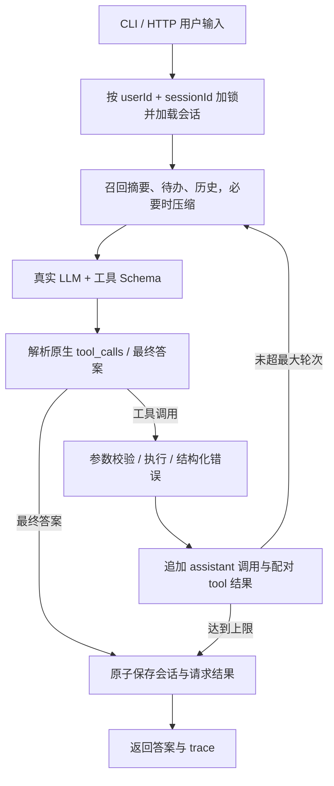

# Minimal Agent：个人安排与工作整理助手

一个使用**真实千问 API**、由 Node.js 标准库实现的 Agent。核心代码没有 LangGraph、LangChain、OpenHands、OpenClaw、PI 或 Agent SDK，也没有第三方运行依赖。

代码仓库：<https://github.com/Kyousuk1e/Vibe-coding-Agent>

这是一个可以独立复制、运行和提交的 **JavaScript / Node.js 项目**。源码、测试、配置样例、运行脚本、验证记录与 CI 都在本项目目录中。

## 业务背景与项目目标

个人在工作与生活中经常需要来回切换聊天、资料查询、计算和待办记录。例如先了解出行天气，再记一条带伞待办；或者把本周工作事实整理成周报，并记录下周要做的事项。本项目用自然语言入口把这些步骤串起来，同时保留可检查的工具结果和会话状态。

目标用户是需要管理日常安排与整理工作内容的个人使用者，也适合后端开发者学习一个 Agent 的完整执行过程。项目范围是单机最小可用原型：完成工具决策、真实执行、状态保存、连续追问和故障处理，便于验证从零实现 Runtime 的工程细节。

| 典型场景 | 用户输入 | 业务结果 |
| --- | --- | --- |
| 日常安排 | 查询上海天气，并记一条“明天带伞”的待办 | 展示明确标注为模拟的天气，创建真实的本地待办记录 |
| 工作整理 | 本周完成工具注册，下周补测试。写周报，并记待办“周五提交周报” | 根据提供的事实整理文本，同时保存待办 |
| 信息与计算 | 搜索上下文压缩资料；计算 `(123+456)*7` | 查询本地演示资料或安全计算，返回可核对的来源与数值 |
| 连续追问 | 把刚才带伞那项标记完成 | 使用当前会话中的真实待办 ID 更新状态 |
| 多窗口使用 | 同一用户分别打开天气窗口、周报窗口 | 两个 Session 的历史、摘要、待办互不混入 |

这是单 Agent、多 Session 设计。周报由模型根据用户给出的事实生成；没有独立“周报 Agent”、协调 Agent 或自动定时提醒服务。

LLM 自主选择直接回答或调用 `calculator`、`search`、`todo`、`weather`。只有 search/weather 的数据是明确标识的 mock；生产运行入口不会回退到 mock LLM。离线测试使用可控响应来验证运行时，真实模型验收单独运行。

## 运行方式

需要 Node.js **22.13+**（已有本地验证使用 Node.js 24）。无需 `npm install`。以下命令均假定终端当前位于本项目根目录，即能看到 `package.json`、`src/` 和本 README 的目录；复制出整个项目后命令不变。

```powershell
Copy-Item .env.example .env
```

macOS/Linux 对应命令为 `cp .env.example .env`。

编辑 `.env`，填入自己的百炼 API Key：

```dotenv
LLM_PROVIDER=qwen
DASHSCOPE_API_KEY=在本地填写真实密钥
LLM_BASE_URL=https://dashscope.aliyuncs.com/compatible-mode/v1
LLM_MODEL=qwen-plus
```

默认地址是北京地域的兼容接口。也可填百炼控制台提供的业务空间专属 Base URL；密钥与接口应使用同一服务配置，Base URL 不包含 `/chat/completions`。参见[百炼 OpenAI 兼容说明](https://help.aliyun.com/zh/model-studio/compatibility-of-openai-with-dashscope)。实际 `.env` 不应进入版本控制，日志不会记录 API Key。

终端 0 启动服务：

```powershell
npm start
```

终端 1：

```powershell
npm run chat -- --user A --title 天气和待办
# 输入：查询上海天气，并添加一条待办：明天带伞
# 追问：把刚才那项标记完成
```

终端 2：

```powershell
npm run chat -- --user A --title 周报和待办
# 输入：本周完成工具注册，下周补测试。写一段周报，并记待办：周五提交周报
# 输入：/todos
```

两个窗口默认创建不同 session。CLI 会打印 session ID 与续聊命令；关闭窗口或重启服务后，用同一 ID 恢复：

```powershell
npm run chat -- --user A --session <之前打印的sessionId>
```

CLI 命令：`/sessions` 列出自己的会话，`/use ID` 切换，`/new 标题` 新建，`/todos` 查看持久化待办，`/trace` 查看最近执行日志，`/retry` 重发网络失败请求，`/exit` 退出。每条普通消息自动生成 requestId，`/retry` 复用原 ID。

也可以切换兼容的 OpenAI 模型：设置 `LLM_PROVIDER=openai`、`OPENAI_API_KEY`、`LLM_BASE_URL=https://api.openai.com/v1` 和 `LLM_MODEL`。默认交付与真实验收针对千问。

## 系统设计

千问负责理解用户输入、阅读 context/system、根据工具描述和参数 Schema 选择工具，以及结合观察结果生成回复。自行编写的 Runtime 负责加载状态、构建请求、解析输出、校验和执行工具、回填结果、控制轮次、保存状态并记录 trace。模型提出调用不会自动执行；执行权始终在程序中。

`AgentRuntime` 通过构造函数接收 `store`、`client`、`registry`、`context`、`traceWriter` 等模块。依赖注入使离线测试能够只替换 LLM 返回，继续执行相同的真实主流程。`maxSteps` 是循环配置，不是工具或模型。



关键文件：

| 文件 | 职责 |
| --- | --- |
| [src/runtime.js](src/runtime.js) | 自写 for 循环、终止条件、工具结果回填、失败回滚与幂等 |
| [src/llm.js](src/llm.js) | fetch 调用真实 API、超时、有限重试、错误脱敏 |
| [src/parser.js](src/parser.js) | 解析原生 tool_calls、参数 JSON、简短决策摘要与最终答案 |
| [src/registry.js](src/registry.js) | 工具注册、发布 Schema、递归参数校验、超时及状态隔离 |
| [src/tools.js](src/tools.js) | 4 个工具实现 |
| [src/store.js](src/store.js) | 会话持久化、所有权检查、单进程内按 session 排队 |
| [src/context.js](src/context.js) | memory 召回、完整回合压缩、上下文硬限制 |
| [src/trace.js](src/trace.js) | 按会话保存 JSONL trace |
| [src/server.js](src/server.js) / [src/cli.js](src/cli.js) | 本地 HTTP API 与多窗口入口 |

项目结构：

```text
.
├── src/                   # Runtime、LLM、工具、Session、Context、HTTP/CLI
├── test/                  # node:test 离线测试
├── scripts/               # 语法检查与真实 LLM 验收
├── docs/                  # API、用例、证据、开发记录
├── .github/workflows/     # Node.js 多平台 CI
├── .env.example           # 配置样例
├── package.json           # 运行命令；无第三方依赖
└── README.md
```

LLM 请求使用 Chat Completions 的 `tools` 和 `tool_choice: auto`，选择逻辑没有关键词路由。每个工具的名称、描述、参数 Schema 来自注册表。千问发送 `max_tokens`、`enable_thinking: false`；本地校验始终执行，不依赖供应商严格 Schema 模式。协议依据[千问 Function Calling 文档](https://help.aliyun.com/zh/model-studio/qwen-function-calling)。

模型输出解析为两类：

- 工具：读取 `message.tool_calls`，提取调用 ID、函数名和 JSON 参数；每个调用产生对应 `role: tool` / `tool_call_id`。单条参数错误会作为工具结果交回模型修正；整条协议无效则终止本轮。
- 最终答案：优先解析 `{"decision_summary":"简短行动摘要","answer":"最终回答"}`，兼容普通文本和 JSON 代码块。仅记录可解释的简短决策摘要；不提取或保存隐藏思维链。原生工具调用 content 为空时，日志明确使用根据工具名生成的行动标签。

## 工具

| 工具 | 参数 | 行为 |
| --- | --- | --- |
| calculator | `expression` | 递归下降解析器，支持四则运算、`%`、`**`、括号、科学计数；不用 eval |
| search | `query` | 搜索内置 Agent/session/压缩/周报语料，返回 `mock: true` |
| todo | `action`, `id`, `text` | 当前 session 内 add/list/complete/remove；不用的字段填 null |
| weather | `city` | 上海、北京、杭州、深圳、广州固定模拟天气，返回来源标识 |

例如添加待办参数为 `{"action":"add","id":null,"text":"明天带伞"}`。Todo UUID 由工具创建；其他会话的 ID 无法操作。单会话最多 20 条，每条最多 200 个字符，并有序列化容量限制以保证基本上下文可用。计算器使用 JavaScript 浮点数，适合普通算术，不保证财务十进制精度。

扩展工具只需 `registry.register({ name, description, parameters, execute })`。Schema 校验器明确只支持本项目所需的严格子集：object/array/string/number/integer/boolean/null、required、additionalProperties=false、enum、anyOf、长度和数值范围；不支持的关键字在注册时拒绝，避免假装完整实现 JSON Schema。可选参数用 nullable + required 表示。

## Session 与 memory：何时召回、放在哪里

持久化键是 `(userId, sessionId)`，文件名使用两者的哈希，不用用户名拼接路径。每条用户消息先加载自己的会话快照。同一 session 的整轮读、改、写串行；不同 session 可并发。CLI 统一连接一个服务进程，因此两个终端不会成为两个独立存储写入者。

每次模型调用前，按以下顺序组装 context：

| 顺序 | 信息 | 用途与处理 |
| --- | --- | --- |
| 1 | system prompt | 固定行为规则、工具结果与记忆的信任边界 |
| 2 | memory 数据消息 | 旧历史摘要 + 当前 session 的完整结构化 todos；明确标注历史数据、不作为新指令 |
| 3 | 最近完整历史回合 | 用户原话、最终答案、成功回合内工具调用与结果；支持指代和连续追问 |
| 4 | 当前回合全部消息 | 当前输入、原生 assistant tool_calls、配对 tool 结果，直到产生最终答案 |
| 单独字段 | tools Schema | 每次请求都发布工具定义，由模型自主选择 |

**召回时机**是每次 LLM 调用前，不仅是收到新用户输入时；因此本轮新写入的待办在下一次调用中立即可见。这个最小实现不使用向量库或跨用户长期记忆：所有相关记忆都来自当前 session，按时间和结构化状态召回。

简短决策摘要放在 trace，不把冗长推理反复塞入历史。最终回答只保存解码后的 answer。工具结果作为观察值保留，可支持“把刚才的结果乘二”“完成刚才那项”等追问；当前待办状态始终以结构化 todos 为准，旧工具结果不能覆盖它。

当 `JSON.stringify({messages, tools}).length` 超过 `MAX_CONTEXT_CHARS`（默认 24000）时：

1. 先把较早的完整用户回合压成带角色/工具来源的摘录摘要，优先保留最近 4 个回合。
2. 仍超限则继续压缩较旧回合，再缩短摘要；摘要最多 4000 字符，显式标记丢失内容。
3. 当前回合、Schema 和结构化 todos 不被静默截断。它们本身仍超限时返回 `CONTEXT_LIMIT`，提示缩小任务。

这是确定性的有损摘要，不额外调用 LLM，保留早期片段和最新片段；不能保证永久记住任意旧事实。压缩按完整回合执行，不会留下悬空 tool_call。字符限制是简单工程预算，**不是精确 token 计数**；输出 token 单独限制。压缩后的历史替换旧历史，不额外保存完整对话归档。

## 异常、持久化和 trace

- 每条用户消息最多 8 次逻辑模型调用（可配置 1–30），每次最多 4 个工具。HTTP 重试在单次逻辑调用内部，最多额外重试 2 次，仍有明确上限。
- 429、5xx、网络失败和超时采用有限退避；400/401 等不盲目重试。API 失败不会伪装成成功回答。
- 工具参数不合法、未知工具、除零、超时等统一返回 `{ok:false,error:{code,message}}`，模型可据此继续循环。
- 工具在隔离的 session 副本上执行；成功且结果通过校验后才合并 todos。整个用户回合若发生 LLM/上下文错误，待办修改回滚，只保存输入和失败说明；达到最大轮次属于明确的部分完成，保留已成功的本地操作。
- 完整回合结束时写临时文件，再 rename 为会话文件。损坏数据明确报错并保留原文件。崩溃前未提交的本轮本地修改不会保留。
- 最近 20 个 requestId 的结果持久化缓存；相同 ID + 输入可重放，避免网络重试重复添加待办；同 ID 不同输入返回 409。超出缓存窗口不承诺幂等。
- trace 同时随响应返回并追加至 `data/traces/*.jsonl`，包含 requestId/sessionId、步骤、决策摘要、工具名、截断后的参数和结果、耗时、状态与 token 用量（供应商提供时）。不记录 API Key 或完整原始 LLM 响应。trace 写入失败会单独提示，不把已保存的会话称为失败。

这是单机 MVP：服务只监听 `127.0.0.1`，`X-User-Id` 用于演示 session 归属，**不是登录认证**。不要把它直接暴露到公网；同一 DATA_DIR 仅运行一个服务进程。扩展到多实例时需要真实身份认证和数据库事务/跨进程锁。自定义工具如果访问外部系统，还需要自己的幂等和补偿逻辑；本项目的回滚只覆盖本地 todos。AbortSignal 不能强制中断阻塞的同步代码。

幂等检查发生在获取 Session 锁之后；锁覆盖“读文件 → 查缓存 → 执行 → 保存”，因此同一进程内相同请求并发到达也不会绕过缓存重复执行。状态与 `completedRequests` 保存在同一个会话文件。已经保存的 `error` 或 `max_steps` 也会被原 requestId 重放；确需重新执行时应创建新请求。请求级防重不会消除同一轮中模型重复提出 `todo.add` 的问题，也不能替外部订单服务保证仅下单一次。

## 已实现范围与后续扩展边界

| 已实现 | 当前边界 / 如需扩展 |
| --- | --- |
| 真实千问原生工具调用与有界循环 | 模型仍可能遗漏工具；自然语言“已完成”不是成功凭证 |
| 本地 Session JSON、同一会话串行、不同会话并发 | 没有数据库、Redis、消息队列或分布式锁 |
| 历史摘录压缩、当前待办独立召回 | 没有向量数据库、跨 Session 召回、无限记忆或 LLM 摘要服务 |
| 本地待办、演示搜索与天气、普通算术 | 没有联网搜索、实时天气、外部日历同步和定时通知 |
| HTTP/CLI、执行 trace、有限网络重试 | 没有图形界面、流式输出、通用权限 Hook 或多 Agent 调度 |
| 本地用户归属检查与容量限制 | 多租户认证、部署到公网、监控告警需单独实现 |

## 测试与验收

```powershell
npm run check
npm test
npm run test:live
```

`npm test` 完全离线，不要求 API Key；通过可控响应测试真实 Runtime 的分支和状态，而不是用它替代产品 LLM。`npm run test:live` **真的调用配置的 LLM 并产生 API 用量**，执行纯对话记忆、计算、搜索、天气+待办、第二窗口周报、工具追问和重建 Runtime 后恢复；缺失 Key 会失败，不会跳过或报假成功。结果写入本项目内被 Git 忽略的 `docs/live-result.json`，测试使用独立临时目录。

详细用例见 [测试用例](docs/TEST_CASES.md)，历史与当前检查状态见 [验证记录](docs/VALIDATION.md)，已通过的千问实测见 [真实 API 证据](docs/LIVE_API_EVIDENCE.md)。历史记录包含 77 项离线测试和 22 个文件语法检查通过；最新结果以验证记录为准。真实验收包含新建 Runtime 后加载原 Session 继续聊天。独立 CI 配置位于 [.github/workflows/test.yml](.github/workflows/test.yml)，用于 Node 22/24 × Windows/Linux 离线校验；真实 API 测试需要显式运行。

真实测试曾发现模型省略todo调用却声称完成的情况。Prompt已加强多项任务检查，并通过定向回归与完整实测；模型自主决策仍可能出错，调用方应结合实际工具trace和持久化状态判断执行结果，不能仅凭自然语言确认。

## 配置

| 环境变量 | 默认值 | 说明 |
| --- | --- | --- |
| LLM_PROVIDER | qwen | qwen / openai |
| DASHSCOPE_API_KEY | 无 | 千问密钥，必填 |
| LLM_BASE_URL | 北京兼容地址 | 不包含 chat/completions |
| LLM_MODEL | qwen-plus | 须支持原生工具调用和非流式输出 |
| PORT | 8787 | 本地服务端口 |
| DATA_DIR | ./data | 会话与 trace 目录 |
| MAX_STEPS | 8 | 每条用户输入最大逻辑 LLM 调用数 |
| MAX_CONTEXT_CHARS | 24000 | messages + Schema 序列化字符上限 |
| LLM_TIMEOUT_MS | 30000 | 每次 HTTP 尝试超时 |
| LLM_MAX_RETRIES | 2 | 可重试故障的额外尝试数 |
| MAX_OUTPUT_TOKENS | 1200 | 最大生成 token 数 |

HTTP 接口与请求示例见 [API 说明](docs/API.md)。AI 辅助开发的 Prompt 与实际问题解决记录见 [AI Prompt 与问题解决记录](docs/AI_PROMPTS_AND_LOG.md)。
