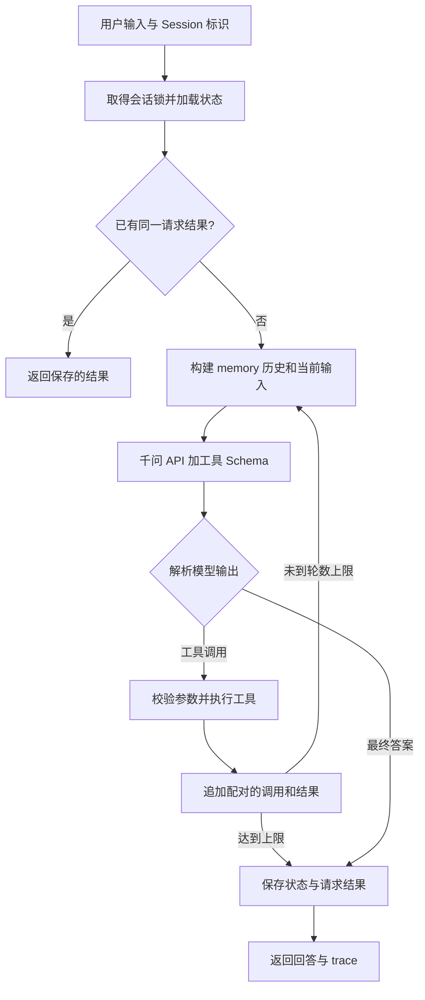

# 个人事务与工作整理 Agent · Python

一个使用**真实千问 API**的个人助手：用户通过自然语言查询信息、进行计算、整理工作内容和管理待办。项目使用 Python 3.11+ 标准库，自行实现 Agent Runtime、工具注册、会话管理与上下文压缩，没有使用现成 Agent 框架或第三方运行依赖。

本目录是一份完整项目，包含源码、测试、配置模板、运行脚本和提交文档。可以单独复制或解压后运行，不需要父目录中的文件。下文所有命令均在本项目根目录执行，即能看到 `agent/`、`tests/`、`scripts/` 和 `.env.example` 的目录。

## 业务背景与目标用户

个人日常和工作信息经常分散在多次对话中：一次查询天气后需要记待办，一次整理周报后又要记录下周事项，之后还会追问或修改。这个项目把“理解需求、使用工具、保存状态、继续追问”放进一个可观察、可测试的流程。

目标用户是需要管理少量个人事务、整理已提供工作材料的学生或职场用户。项目同时作为后端 Agent 的教学与面试示例，展示从零实现循环、会话隔离和可靠执行的方式。

| 场景 | 示例输入 | 实际行为 |
| --- | --- | --- |
| 日常安排 | 查询上海天气，并添加“明天带伞”的待办 | 查询模拟天气，调用待办工具并保存记录 |
| 工作整理 | 本周完成工具注册，下周补测试。整理周报并记“周五提交周报” | 模型根据用户给出的事实整理文字，工具保存待办 |
| 精确计算 | 计算 `(123+456)*7` | 调用 calculator，结果为 4053 |
| 信息查询 | 搜索上下文压缩相关资料 | 搜索内置演示语料，返回模拟来源 |
| 纯对话追问 | 我的项目叫北斗 → 项目叫什么？ | 从当前会话历史或摘要召回名称 |
| 工具追问 | 把刚才带伞的待办标记完成 | 查找当前会话的真实待办 ID，调用 todo complete |

待办中的“明天”或“周五”作为文字保存；项目没有定时提醒或日历调度功能。search 和 weather 明确使用 mock 数据，不能当作实时网络搜索或实时天气。千问本身通过真实 API 调用。

## 快速运行

需要 Python **3.11 或以上**。无需 `pip install`。Windows 可以把下面命令中的 `python` 替换为 `py`。

先复制配置模板；已经配置过 `.env` 时跳过复制：

```powershell
Copy-Item .env.example .env
```

macOS/Linux 使用 `cp .env.example .env`。编辑本项目的 `.env`：

```dotenv
LLM_PROVIDER=qwen
DASHSCOPE_API_KEY=在本地填写真实密钥
LLM_BASE_URL=https://dashscope.aliyuncs.com/compatible-mode/v1
LLM_MODEL=qwen-plus
```

Base URL 不包含 `/chat/completions`。配置文件和数据目录均属于本项目，`.env` 不提交到 Git。启动服务：

```powershell
python -m agent serve
```

另开两个终端，分别进入同一个项目根目录后运行：

```powershell
# 终端 1
python -m agent chat --user A --title 天气和待办

# 终端 2
python -m agent chat --user A --title 周报和待办
```

每个窗口默认创建独立 Session。CLI 打印会话 ID，关闭窗口或重启服务后可继续：

```powershell
python -m agent chat --user A --session <之前的会话ID>
```

默认地址为 `http://127.0.0.1:8787`。使用自定义端口时，可在 `.env` 或环境中设置 `PORT`，也可以显式指定客户端 `--url http://127.0.0.1:8788`。同一数据目录只运行一个服务进程。

| CLI 命令 | 用途 |
| --- | --- |
| `/sessions` | 列出当前用户的会话 |
| `/use ID` | 切换到已有会话 |
| `/new 标题` | 新建会话 |
| `/todos` | 读取当前会话的持久化待办 |
| `/trace` | 查看最近一次请求的执行记录 |
| `/retry` | 重发未收到响应的请求，复用原 requestId |
| `/help`、`/exit` | 显示帮助、退出客户端 |

## LLM 与 Runtime 各自负责什么

**千问负责理解需求和作出决策**：阅读上下文、选择工具、生成工具参数、根据结果继续决策或生成最终回答。

**Runtime 负责执行和约束这些决策**：取得会话锁、构建上下文、请求模型、解析返回、校验参数、分发工具、记录结果、控制轮数，以及保存或回滚本地状态。代码组织采用依赖注入，`store`、`client`、`registry`、`context` 和 `trace_writer` 在创建 Runtime 时传入。



核心代码是 [agent/runtime.py](agent/runtime.py) 中的 `AgentRuntime.run()`。每次用户请求最多进行 8 轮模型决策，每轮默认最多执行 4 个工具。一次用户输入可以产生多次模型调用，网络层重试也不算新的用户回合。

模型返回原生 `tool_calls` 时，解析器提取 `function.name`，把 `function.arguments` 从 JSON 字符串解析为对象。注册表验证参数后执行函数，结果写成 `role: tool` 消息，用 `tool_call_id` 对应原调用 ID。保留原 assistant 调用与结果的完整配对，下一轮模型才能理解执行情况。

最终答案支持普通文本、JSON 代码块和 `{"decision_summary":"简短行动摘要","answer":"回答"}`。只记录简短行动摘要，忽略供应商隐藏推理字段，不保存思维链。

## 项目结构

| 文件或目录 | 职责 |
| --- | --- |
| [agent/runtime.py](agent/runtime.py) | 核心循环、终止条件、回滚和请求幂等 |
| [agent/llm.py](agent/llm.py) | urllib + asyncio 调用真实 API，超时、有限重试和错误脱敏 |
| [agent/parser.py](agent/parser.py) | 原生工具调用、参数 JSON、最终答案解析 |
| [agent/registry.py](agent/registry.py) | 工具注册、Schema 校验、执行隔离与超时 |
| [agent/tools.py](agent/tools.py) | calculator、search、todo、weather |
| [agent/store.py](agent/store.py) | JSON 会话存储、原子保存、会话锁和损坏检测 |
| [agent/context.py](agent/context.py) | memory 注入、完整回合压缩和上下文预算 |
| [agent/trace.py](agent/trace.py) | 按会话记录 JSONL trace |
| [agent/prompt.py](agent/prompt.py) | 实际发送给模型的系统提示词 |
| [agent/app.py](agent/app.py)、[agent/config.py](agent/config.py) | 模块组装与配置读取 |
| [agent/server.py](agent/server.py)、[agent/cli.py](agent/cli.py) | 本地 HTTP 服务与多终端客户端 |
| [tests/](tests/) | 可重复的离线单元与集成测试 |
| [scripts/live_smoke.py](scripts/live_smoke.py) | 真实千问验收脚本 |
| [docs/](docs/) | 接口、测试、验证证据和 AI 开发记录 |

## 四个工具与注册机制

工具以 `registry.register(name=..., description=..., parameters=..., execute=...)` 注册。名称、描述和参数 Schema 发给模型；执行函数保留在后端。模型客户端的 `model` 配置不属于单个工具定义。

| 工具 | 参数 | 实现与边界 |
| --- | --- | --- |
| `calculator` | `expression` | 自写递归下降解析器，不使用 eval；支持四则、取余、幂、括号和科学计数 |
| `search` | `query` | 搜索固定的 Agent、Session、上下文和周报演示语料；返回 mock 和来源 |
| `weather` | `city` | 上海、北京、杭州、深圳、广州的固定模拟天气 |
| `todo` | `action`、`id`、`text` | 当前 Session 内 add/list/complete/remove；不用的字段填 null |

例如添加待办的参数是 `{"action":"add","id":null,"text":"明天带伞"}`。完成待办需要使用已保存的真实 ID：`{"action":"complete","id":"实际ID","text":null}`。ID 由工具生成，模型不能猜测。

Schema 校验支持本项目需要的严格子集，包括类型、required、additionalProperties=false、枚举、nullable、长度和数值边界；注册时拒绝未支持的 Schema 关键字。工具返回 `{ok:true,data:...}` 或 `{ok:false,error:{code,message}}`，可恢复的工具错误交回模型修正。

同步工具在线程中执行，异步工具使用协程；执行时复制会话和参数，仅在结果成功且合法时合并待办状态。超时后的迟到返回不能修改原会话。待办最多 20 项，标题最多 200 个 Unicode 字符，并限制序列化容量。计算器使用浮点运算，不提供财务十进制定点精度。

## Session 与 memory

这是**单 Agent、多 Session**项目。`userId + sessionId` 共同定位会话，两个相同用户的窗口使用不同 sessionId，历史、摘要和待办互不混入。

会话存储使用本地 JSON 文件，不需要数据库或向量库。文件名分别对用户与会话 ID 做 SHA-256 哈希；内容包括 `id`、`userId`、`title`、时间戳、`messages`、`summary`、`todos` 和 `completedRequests`。相同 Session 的锁覆盖“读取 → 查缓存 → 整轮执行 → 保存”，不同 Session 可以并发运行。

**memory 在每次调用 LLM 前召回**，包括同一用户回合内工具执行后的下一轮调用。发送顺序如下：

| 顺序 | 内容 | 作用 |
| --- | --- | --- |
| 1 | system prompt 与 memory 信任规则 | 规定工具使用、任务完成与数据边界 |
| 2 | `SESSION_MEMORY_DATA` 用户角色消息 | 历史摘要与当前完整结构化 todos，明确作为数据 |
| 3 | 保留的完整历史回合 | 用户原话、回答和工具结果，支持指代追问 |
| 4 | 当前回合所有消息 | 本次输入和已经执行的工具调用与结果 |
| 独立字段 | tools Schema | 让模型选择工具，仍计入请求字符预算 |

当前 `todos` 是待办状态的权威来源，不由旧摘要或旧日志覆盖。普通对话信息依赖历史或摘要；没有永久保留任意旧事实的保证。

默认对序列化后的 `messages + tools` 设置 24000 字符预算。超限时，把较早的**完整用户回合**压成带角色和工具来源的摘录摘要，优先保留最近 4 个完整回合，摘要最多 4000 字符；必要时进一步减少历史或摘要。

压缩由程序确定性执行，不额外请求模型，是有损压缩。保留的工具调用与结果必须配对。当前回合、系统规则、工具 Schema 和当前 todos 不会被静默截断；这些必要信息本身放不下时返回 `CONTEXT_LIMIT`。预算使用 Python Unicode 字符数，不是精确 token 数。

## 异常、幂等与日志

- 网络超时、429 和部分服务端故障进行有限重试；默认每次 HTTP 尝试 30 秒、最多额外重试 2 次。认证失败和普通参数错误不盲目重试。
- 待办修改先暂存在当前回合内存中；后续 LLM 或上下文错误导致本轮失败时，恢复回合开始前的 todos，并仅保存本轮用户输入和失败说明。
- 达到 `max_steps` 表示部分完成，保留成功操作并明确说明。它与异常回滚不同。
- 回合结束时把状态和请求结果一起写到临时文件，刷新后用 `os.replace` 替换会话文件。损坏的已有文件明确报错并保留。
- 同一 Session 保存最近 20 个 requestId 的输入摘要与结果。相同 ID、相同输入返回原结果且 `replayed=true`，不再调用模型或工具；同 ID 不同输入返回 409。已保存的 error 和 max_steps 结果也可重放。
- trace 随响应返回，并写入 `data/traces/` 的 JSONL 文件，记录调用 ID、工具、参数与结果摘录、耗时、状态及供应商 token 用量。不记录密钥或完整原始响应。

请求幂等只覆盖重复提交的用户请求，且受缓存容量限制。它不保证同一回合内部重复工具调用、外部订单或邮件等副作用的幂等性。会话锁仅在一个服务进程的共享 Store 内有效。本项目没有数据库事务、分布式锁、订单操作表或多租户身份认证。

## 测试与验收

```powershell
python scripts/check.py
python -m unittest discover -s tests -v
```

离线测试控制模型响应或传输层，实际执行 Runtime、工具、Context、JSON Store 和 HTTP 服务。已有 **95 项 Python 离线用例**，覆盖正常流程、状态边界、真实并发重叠、失败和上限结果重放、压缩后工具追问，以及服务与 CLI 子进程入口。测试映射见 [docs/TEST_CASES.md](docs/TEST_CASES.md)。

真实模型验收需要本地配置密钥，会产生 API 用量：

```powershell
python scripts/live_smoke.py
```

脚本不使用模拟 LLM，也不会在缺少密钥时假装通过。结果写到本项目被 Git 忽略的 `docs/live-result.json`，公开证据见 [docs/LIVE_API_EVIDENCE.md](docs/LIVE_API_EVIDENCE.md)。历史千问验收通过 8 轮对话与 1 项持久化检查，共 15 次模型调用、7 次工具执行；时间、代码版本与当前独立打包检查分别记录在 [docs/VALIDATION.md](docs/VALIDATION.md)。

模型措辞不作为唯一成功标准：测试核对工具调用、真实结果、待办 ID 和数量、完成状态以及重新加载后的数据。恢复测试中的新 Runtime 在同一进程重建，不能等同于断电恢复测试。

本项目包含自己的 [.github/workflows/test.yml](.github/workflows/test.yml)，可作为独立仓库在 Windows/Linux、Python 3.11/3.14 上运行语法与离线检查。真实 API 不放进常规 CI。

## 配置

| 环境变量 | 默认值 | 说明 |
| --- | --- | --- |
| `LLM_PROVIDER` | `qwen` | 千问；也可选择兼容客户端的 `openai` 模式 |
| `DASHSCOPE_API_KEY` | 无 | 千问真实密钥，必填 |
| `LLM_BASE_URL` | 百炼北京兼容接口 | 不包含 `/chat/completions` |
| `LLM_MODEL` | `qwen-plus` | 需要支持原生工具调用 |
| `PORT` | `8787` | 本地服务端口 |
| `DATA_DIR` | `./data` | 本项目会话与 trace 目录 |
| `MAX_STEPS` | `8` | 每次用户请求的模型决策轮数 |
| `MAX_CONTEXT_CHARS` | `24000` | 序列化上下文与工具 Schema 的字符预算 |
| `LLM_TIMEOUT_MS` | `30000` | 每次 HTTP 尝试超时 |
| `LLM_MAX_RETRIES` | `2` | 可重试错误的额外尝试次数 |
| `MAX_OUTPUT_TOKENS` | `1200` | 单次输出 token 上限 |

## 当前限制与提交资料

这是单机本地 MVP：监听地址固定为 `127.0.0.1`，`X-User-Id` 只演示会话归属，不能代替登录认证；不提供浏览器跨域访问、消息队列、流式输出或自动提醒。HTTP 请求体最多 32KB，使用 Content-Length。线程或不合作的异步代码无法被 Python 强制终止，外部工具需要自行处理取消、幂等和补偿。

详细交付文档全部位于本项目内：

- [HTTP API](docs/API.md)
- [测试用例与要求映射](docs/TEST_CASES.md)
- [验证记录](docs/VALIDATION.md)
- [真实千问验收证据](docs/LIVE_API_EVIDENCE.md)
- [AI Prompt 与问题解决记录](docs/AI_PROMPTS_AND_LOG.md)
